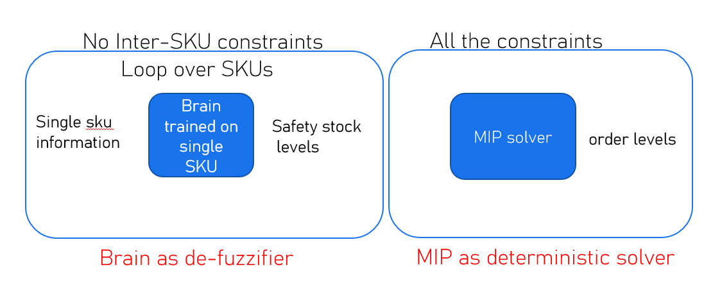
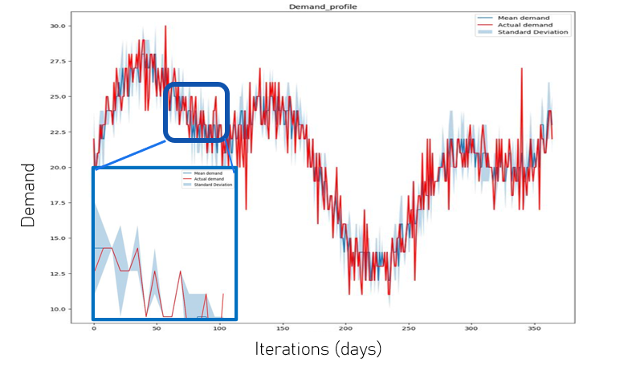
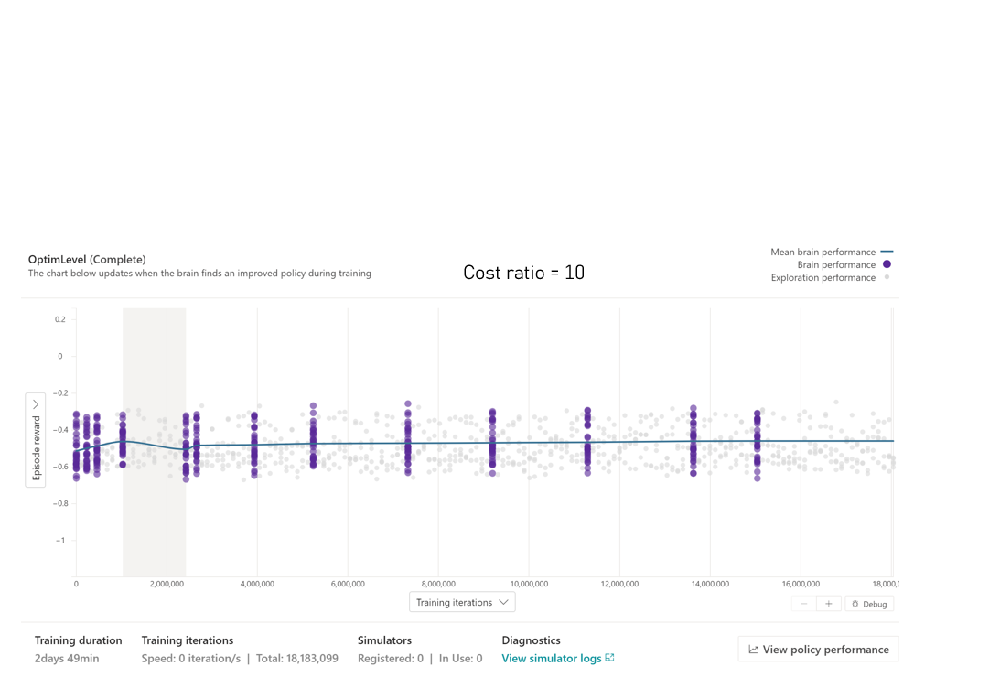
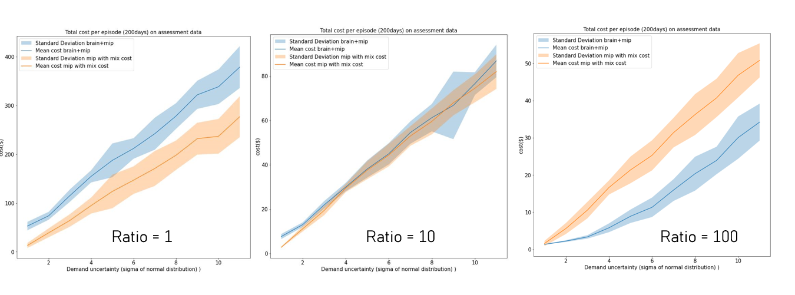

# Inventory Management using hybrid approach based on brain (deep reinforcement learning) and classical optimization method (mixed integer programming) 

# Prerequsite:
Create supplychain conda envionment and activate it
```
conda env update -f environment.yml
conda activate supplychain
```

## Bussiness problem

A retailer faces uncertain consumer demand from day to day and need to hold inventory levels to meet costumer demand. He deals with 100s of products. High inventory levels have holding costs and low inventory levels would not satisfy customer needs and results in missed sale cost. Additionally, customer faces some constraints, such as total inventory capacity. Additionally, each product has a different missed sale to inventory cost ratio. The Goal is to keep inventory levels at an optimal levels, such that it results in a good trade-off between service level and holding costs and meets total inventory capacity as much as possible.

Periodically, the retailer wishes to make optimal decisions on safety stock levels and periodic purchase order levels for all the stages of the supply chain. The retailor has access to demand forecast at customer level. However, the future forecasts are uncertain and depend on variable forecast confidence intervals, i.e forecasts are presented through mean and standard deviation. 

The retailer's supply chain resembles a multi-echelon inventory system, where all the products are resources from same distribution/manufacturing centers. The following image shows a multi-echelon inventory system. Each stage has inventory holding areas and capacitated production area, except the stage0. Retails


[reference: Hubbs et al.: OR-Gym: A Reinforcement Learning Library]

We continue with M=3. As and example, the retailor is located in New York. He makes product purchases from a distribution center in Tennessee, with a lead time of 2 days. The Tennessee distribution center makes the purchases from another distribution center in Los Angeles with a lead time of 3 days. Subsequently, this LA distributor makes purchases from a manufacturer in China with a lead time of 4 days. The manufacturer has access to unlimited supply of raw materials. 

### Solution architecture

we propose a hybrid approach due to the following reasons:

(1) 100s of products with constraints leads to curse of dimensionality where AI only solutions becomes cumbersome if not practically impossible to train. 
(2) On the other hand, classical optimization methods becomes practically difficult/impossible to tackle uncertainty in an time efficient way. Searching optimal solution may take very long time.

As an alternative, we will use brain as a de-fuzzifier that makes a crisp decision on ideal safety stock levels for each product without considering any cross-product constraints. We train brain for products with different missed sale to inventory holding cost ratio (e.g. 10, 100, 1000). Once brains are trained, we will loop over the products with different cost ratio and use mip solver to make final adjustments on the purchase order levels.  

The below image summarizes the approach:



### Objective
Minimize cost of missing demand + cost of holding for each single product. 


|                    | Defintion  | Notes |
| -------------------| -----------|-------|
|Observations        |transit orders, demand_forecast, demand_sigma, current_demand, inventory, leads, misses_sale_to_inventory_cost_ratio|demand_sigma: standard deviation of the forecasts|
|Actions | safety stock levels for each stage|
|Control frequency| user defined | retailor can decide on time interval of adjusting the future expected safety stock levels  
|Episode Configuration| demand profile parameters, sigmax, offset, amp1, ph1, amp2, ph2, randvar, lead profile, missed_sale_to_inventory_cost, action frequency | custom demand is parameterized to manage demand properties such as (1) sigmax: max uncertainty threshold (2)offset: offsets demand levels, amp1,ph1, amp2, ph2: non-stationarity, randvar: baseline demand noise. Various lead profiles are available for more complex situations such as variable lead times, etc|

An example demand profile consumed by the simulator is shown below showing actual and forecasted demand. Note seasonality, noise, and forecast uncertainty. 



### Sim packages (RL plus mip)

To build bonsai sim package, login using azure-cli and then run the following command.

```
az acr build --image IMAGENAME --file Dockerfile_mipPlusBrain --registry YOURBONSAIREGISTRY .
```

### Brain training

Use the following inkling file in bonsai platform to train brain that handles a single sku with wide range of missed sale to inventory cost ratio. You may also chose a separate brain for a specific missed sale to inventory cost ratio. 

```
MachineTeacher_Tutorial
```

### Assessment logs

To create assessment logs for 

(1) multi-sku mip plus brain approach:
first export trained brain and then run
```
python main_assess_mip_plus_brain_or_other_safety_policy.py --test-exported 
--log-iterations
```
(2) multi-sku mip only approach:
run the following command 
```
python main_assess_mip_only.py --test-local --log-iterations 
```
Take note of "assess_config.json" for details of the experiment, such as number of skus and total inventory capacity.

## Results and Analysis
### brain training results on single sku:
We studied the effects of demand forecast uncertainty and ratio of missed sale cost to inventory holding (cost ratio). Conservatively, we trained different brains for different cost ratio. A sample brain training graph is shown below.


The image below shows total cost vs level of uncertainty for different cost ratios. Brain plus mip outperforms classical optimizer when cost ratio is higher. This makes sense as higher missed sales cost accentuates the need for safety stock levels. When cost ratio is equal to one, there is no need to hold safety stock level as holding extra inventory is as costly as missing the sale.


