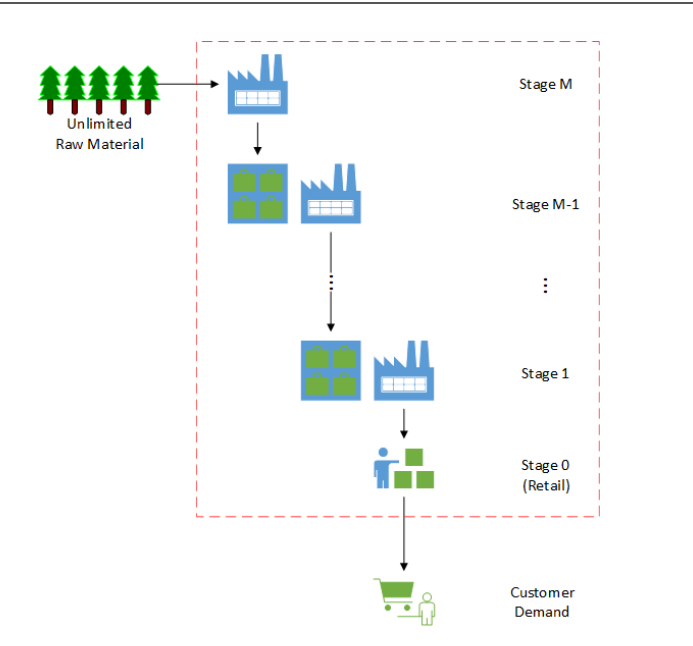

# Inventory Management using hybrid approach based on brain (deep reinforcement learning) and classical optimization method (mixed integer programming) 

# Prerequsite:
Create supplychain conda envionment and activate it
```
conda env update -f environment.yml
conda activate supplychain
```

## Bussiness problem

A retailer faces uncertain consumer demand from day to day and need to hold inventory levels to meet costumer demand. He deals with 100s of products. High inventory levels have holding costs and low inventory levels would not satisfy customer needs and results in missed sale cost. Additionally, customer faces some constraints, such as total inventory capacity. Additionally, each product has a different missed sale to inventory cost ratio. The Goal is to keep inventory levels at an optimal levels, such that it results in a good trade-off between service level and holding costs and meets total inventory capacity as much as possible.

Periodically, the retailer wishes to make optimal decisions on safety stock levels and periodic purchase order levels for all the stages of the supply chain. The retailor has access to demand forecast at customer level. However, the future forecasts are uncertain and depend on variable forecast confidence intervals, i.e forecasts are presented through mean and standard deviation. 

The retailer's supply chain resembles a multi-echelon inventory system, where all the products are resources from same distribution/manufacturing centers. The following image shows a multi-echelon inventory system. Each stage has inventory holding areas and capacitated production area, except the stage0. Retails



[reference: Hubbs et al.: OR-Gym: A Reinforcement Learning Library]

We continue with M=3. As and example, the retailor is located in New York. He makes product purchases from a distribution center in Tennessee, with a lead time of 2 days. The Tennessee distribution center makes the purchases from another distribution center in Los Angeles with a lead time of 3 days. Subsequently, this LA distributor makes purchases from a manufacturer in China with a lead time of 4 days. The manufacturer has access to unlimited supply of raw materials. 

### Solution architecture

we propose a hybrid approach due to the following reasons:

(1) 100s of products with constraints leads to curse of dimensionality where AI only solutions becomes cumbersome if not practically impossible to train. 
(2) On the other hand, classical optimization methods becomes practically difficult/impossible to tackle uncertainty in an time efficient way. Searching optimal solution may take very long time.

As an alternative, we will use brain as a defuzzifier that makes a crisp decision on ideal safety stock levels for each product. We train brain for products with different missed sale to inventory holding cost ratio (e.g. 10, 100, 1000). 


we will use the following design architecture, where we will train a brain for 


### Objective
Minimize overall cost, i.e. cost of missing demand + cost of holding.

|                    | Defintion  | Notes |
| -------------------| -----------|-------|
|Observations        |state_list: composed of 33 states. | inventory levels at three levels of this multi-echelon problem +  10 previous actions|
|Actions | Order level for the 3 stages, all the stages except raw material that is inf|
|Control frequency| Monthly | 
|Episode Configuration| demand_distribution_profile| 1: poisson distribution 2: binomial distribution 3: uniform random integer 4: geometric distribution 5: user supplied demand values|
